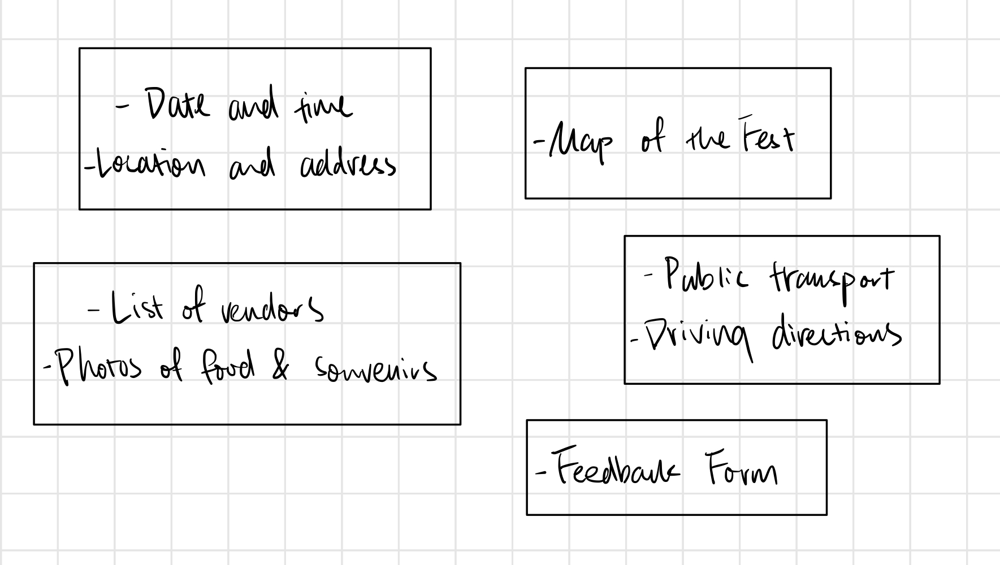
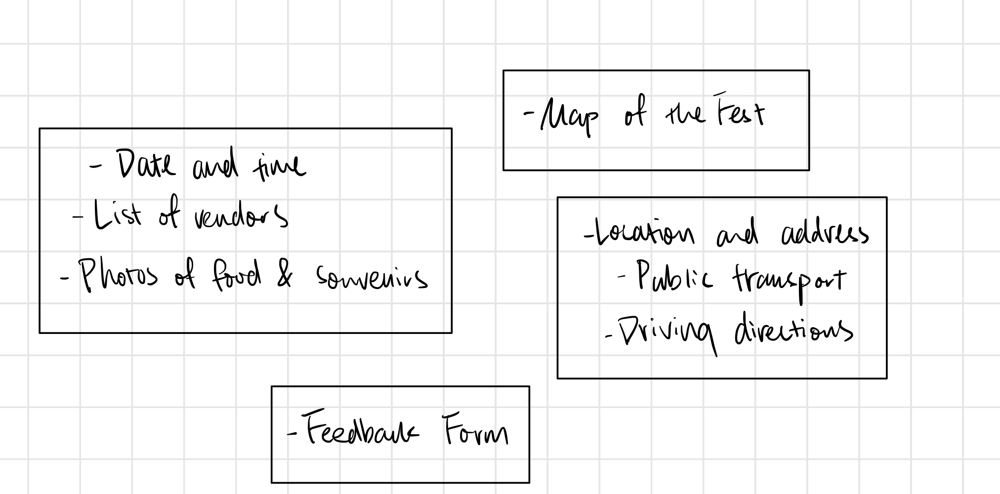

# Project 1: Design Journey

**For each milestone, complete only the sections that are labeled with that milestone.**

Be clear and concise in your writing. Bullets points are encouraged.

**Everything, including images, must be visible in Markdown Preview.** If it's not visible in Markdown Preview, then we won't grade it. We won't give you partial credit either. This is your warning.


## Existing Design, Planning, & Refined Design (Milestone 1)

### Existing Site: The Site (Milestone 1)
> What is your existing site about? Tell us about it.

My existing site is about the 2020 Ithaca Apple Festival, specifically its information about time, location, transportation, shops, and restaurants, etc. The site also contains a feedback form where the user can submit feedbacks about the festival or the site.

> How and where did you create this site?

I created this site last semester as Project 3 in the course INFO 1300.

> Is this site designed for desktop, mobile devices or both?

This site is responsive for both.


### Existing Site: Audience (Milestone 1)
> Who is your _existing_ site's audience?
> Briefly explain who the intended audience(s) is for your website. Be specific and justify why this audience is appropriate for your site. Remember, you may not be the audience.

The intended audience for this website is the freshmen population at Cornell who wish to go to the Ithaca Apple Fest. They have just come to Cornell and have not yet explored events happening around Ithaca. This site would be a perfect guide for them to gain more information about one of the biggest events happening every year, including information about how to get to the location or what fun activities to do at the Fest.


### Existing Site: Audience Needs (Milestone 1)
> Document your existing site's audience's needs. (These should be informed by user research. Not assumptions.)
> List each need below. There is no specific number of needs required for this, but you need enough to do the job.
> You may copy these from your previous project. However, I would encourage you to refine them.

Need/Want 1: Map of the Fest
- **Needs and Wants** _What does your client and audience need and want?_
  - My audience needs a clearly labeled map of the Apple Fest in order to navigate around the festival and find shops or restaurants they desire to visit without getting lost.
- **Design Ideas and Choices** _How will you meet those needs and wants?_
  - I will meet the needs by including a page of the festival map with locations and vendors clearly labeled. The page should be very easy to access to from the homepage of the site (preferably as a tab in the navigation bar), since the users will refer to this map very often during the Fest.
- **Rationale & Additional Notes** _Justify your decisions; additional notes._
  - The audience will be able to check the map before the festival to plan out routes of activities they would like to do. They will also be able to conveniently access the map on the day of the Fest to check their locations and nearby vendors to visit.

Need/Want 2: Shops and Restaurants
- **Needs and Wants** _What does your client and audience need and want?_
  - My audience would want to see a list of shops and restaurants at the Apple Fest so that they can plan beforehand what they would like to do on the day of the festival. Using this list with the map provided, they can easily plan out a route to follow to visit the vendors that interest them.
- **Design Ideas and Choices** _How will you meet those needs and wants?_
  - I will include a comprehensive list of shops and restaurants at the Fest as a page on my website, where the users will be able to read through and decide for themselves which vendors interest them. The descriptions will include the vendors' locations, which are referred to on the festival map.
- **Rationale & Additional Notes** _Justify your decisions; additional notes._
  - This list is for the users to browse at home before they go to the Apple Fest, when they can read through the vendors and decide their routes. It will also be used on the day of the Fest when users change their mind and wish to visit other vendors that attract them. Therefore this page is responsive to both desktop and mobile screens.

Need/Want 3: Transportation to the festival
- **Needs and Wants** _What does your client and audience need and want?_
  - My audience will need to know ways to get to the Apple Fest. Since my audience will be Cornell freshmen, most of them do not own a car. They will need to know means to go to the festival on their own.
- **Design Ideas and Choices** _How will you meet those needs and wants?_
  - I will include a page with a map of the address and location of the festival, as well as a link to the TCAT bus website to help users who need take public transportation to plan their trip from their place to the festival. I will include the hours that TCAT is running and also some tips for my audience to transport from their dorms on North Campus to downtown.
  - For users who own a car, I will include a list of parking places where the users can park their vehicles and have a short walk to the festival. I will include the parking rates and hours.
- **Rationale & Additional Notes** _Justify your decisions; additional notes._
  -This design will accommodate both kinds of users using different transportation means. Bus routes for freshmen to travel to and from the festival might be the most helpful for my intended audience. They will likely visit this page when planning beforehand and on the day to the festival.

Need/Want 4: Feedback Form
- **Needs and Wants** _What does your client and audience need and want?_
  - My audience will need a way to submit their feedbacks or issues encountered at the Fest so that they can solve any problems occurred or help make future festivals become better.
- **Design Ideas and Choices** _How will you meet those needs and wants?_
  - I will include a feedback form on the site where users can submit their name, date of visit, any positive or negative feedbacks, any issues encountered, and their contact information. This way the users may be contacted if any issues need to be resolved, and through the feedbacks the Fest or this site could be improved for the future. The form is designed to be well aligned, short, and straightforward so that users do not get impatient when filling out the form.
- **Rationale & Additional Notes** _Justify your decisions; additional notes._
  - This form is meant for users to fill out after going to the Apple Fest. They can be filled out on desktop screens or conveniently on mobile screens on their way back from the festival.

### Existing Site: Design/Sketches (Milestone 1)
> Sketch your existing site. Include these sketches here.
> DO NOT COPY SKETCHES FROM THE ORIGINAL ASSIGNMENT!
> Create new sketches here. This is part of the design process to get you thinking about the strengths/weaknesses of the current design.
> Provide a brief explanation _underneath_ each sketch.


This is a sketch of my About page where basic information about the Fest is provided.


This is a sketch of my Map page where a festival map with vendors labeled is provided.


This is a sketch of my Shop & Dine page where the information about all vendors is provided.


This is a sketch of my Directions page where information about ways to travel to the Fest is provided.


This is a sketch of my Feedback Form page where users can submit their feedbacks about the Fest or this site.


### Refined Site: Persona (Milestone 1)
> Use the needs your identified above from user research, to develop a persona of your site's audience.
> Your persona must have a name and a "depiction". This can be a photo of a face or a drawing, etc.
> There is no required format for the persona.
> You may type out the persona below with bullet points or include an image of the persona. Just make sure it's easy to read the persona when previewing markdown.

Persona's Name: Heather


Heather is a female Cornell freshman majoring in Biology and Society in A&S and lives on North Campus in Mary Donlon Hall. She is originally from Los Angeles, CA. This is her first time living away from home and from the warm California sun, and she cannot wait to enjoy the seasons here in Ithaca.
She heard about the Apple Fest in Ithaca a while ago before started college, and she cannot wait to go visit the festival with a group of friends living near her.
She does not own a car and relies on TCAT buses to transport everywhere (she has a TCAT pass). She needs to know how to transport to the Fest using TCAT, as she is still new to the local area.
She owns a laptop and a phone to look up information about the festival, and she has access to the internet while on Cornell campus.
She has a prelim coming up soon in mid-October, and she wants to know if she has time to go to the Fest. She wishes to spend a whole day at the festival.
She wants to taste some of the local Ithaca food and buy some souvenirs to bring back to friends and family.
She does not have a good sense of directions and often gets lost even in her own community.
She wishes to have someone to contact if she loses her precious bracelet at the Fest.

### Refined Site: Content Organization/Navigation (Milestone 1)
> Identify the content that is necessary for your persona. **Refer to the persona by name.**
> List the content here. Label the content as "(new)" if it's new to the existing site.
> **Don't forget to include the form.**

- Date and time of the Fest
- Location and address of the Fest
- Map of the Fest for navigation
- List of vendors to shop and dine
- Sample photos of food and souvenirs
- Public transportation directions to the Fest
- Driving directions to the Fest
- A feedback form for reviews


> Organize the content for the audience and identify possible pages for the content using card sorting.
> Document your card sorting by taking a photo and including it here.
> You are **required** to show the alternative organization you considered. (1 card sorting is not enough)


This is my cardsort1.

This is my cardsort2.

> Explain your thought process behind the card sorting. **Refer to the persona by name in your explanation.**

Heather would want to first know the date and time of the Fest to see if she can go on one of those days. She needs the transportation means to know how to get to the festival, and she needs a map to navigate around the Fest. In cardsort2 I grouped the date and time with the vendors list so that Heather can plan whether she can go visit some of the shops during the time she is available. She can also see some sample food and souvenirs that interest her on this page. I also grouped location and transportation directions together in cardsort2 to help Heather navigate to the festival from North Campus. The map of the festival is separately placed on one page to help her find her way around the festival, since she does not have a good sense of direction. She can also use the feedback form on another separate page in case she loses her bracelet and needs to contact the festival's hosts. In cardsort1, I regrouped date, time, and location of the Fest to one page because these are more of the general information about the festival, and Heather could see if she has enough time to travel to downtown on a day of the Fest. I included the transportation means on a separate page so that Heather can pre-decide her travel route to the Fest. The list of vendors and photos are naturally grouped together for Heather to browse before and during the Fest. The feedback form in cardsort1 is still on a separate page for reviews after going to the Fest.


> Lastly, list the pages that resulted from your final card sort (i.e. your site's navigation) and content for each page.

- About
  - Date and time
  - Location and address
- Map of the Fest
  - Fest map with labeled vendors
- Shop & Dine
  - List of vendors and their descriptions
  - Sample photos of food and souvenirs
- Directions
  - Public transportation routes and link to TCAT website
  - Driving directions to the Fest
- Feedback
  - A form for feedback of the Fest or this site and contact means in case of any issues


### Refined Site: Design (Milestone 1)
> Refine the design of your site to meet the needs of your users using your persona.
> Include sketches of each page of the refined design.
> Provide a brief explanation _underneath_ each sketch.
> Document your _entire_ design process. **Show your preliminary sketches and your final sketches.** **We want to see iteration!**
> Don't forget the form and confirmation page!
> **Refer to your persona by name in each explanation.**

I designed my site according to my card sorting 1. I have added some additional elements to fit the users' needs better, such as those of Heather.


This is a refined sketch of my About page where basic information about the Fest is provided. I added the location and address of the Fest on the About page under date and time of the Fest.


This is a sketch of my Map page where a festival map with vendors labeled is provided.


This is a refined sketch of my Shop & Dine page where the information about all vendors is provided. I added more photos of food and souvenirs for Heather to browse to make her looking forward to go to the Fest.


This is a sketch of my Directions page where information about ways to travel to the Fest is provided.


This is a sketch of my Feedback Form page where users can submit their feedbacks about the Fest or this site.


### Partial Plan (Milestone 1)
> Using your refined sketches, plan your site's partials.
> You may describe each partial or sketch it. It's up to you!

- Partial 1: Header
  - Each page's header is the same, so it would be easier to put them in a single partial and include it with PHP.
- Partial 2: Navigation bar
  - Each page's navigation bar is the same and thus can be a partial. However I will include variables in the partial so that the current page on the navigation bar is highlighted when the users navigate to that page.
- Partial 3: Footer
  - The footer is the same on all pages and can be written as one partial to be included using PHP.


## Sticky Form (Milestone 2)

### Sticky Form Planning (Milestone 2)
> What controls do you need for your form?

I need a name input (required), date of visit input (required), two feedback textboxes (first one is required), an email input, and a submit button.


> Plan out your feedback messages for your form. You may sketch (probably the easiest) or write it out.
> Use your persona. Refer to the persona by name. Explain how the feedback messages are usable for your persona.


- After going to the Apple Fest, if Heather has not enjoyed some of her experience at the festival, she can fill out the feedback form. She has to enter her name and date of visit. If she doesn't input her name and date of visit, she will get feedbacks telling her to enter full name and when she went to the Fest (between 9/28/2020 and 10/04/2020).
- Heather also has to provide a feedback she has. If Heather submits the form without filling out her experience, she will get the feedback message saying "*Please give us any feedback about the festival." Heather will then know to provide some feedback.
- If Heather had problems needs to be solved coming back from the Fest, she can fill out any issues she encountered (not required). If she wishes to be contacted about her issue, she will need to provide a valid email address, or she will get a feedback message saying "Please enter a valid email address."

> How does this form meet the needs of your persona?
> Refer to the persona by name.

- Maybe when heading to the festival Heather could not find her way from the bus stop she arrived at to the Commons, and she wishes to have more direction signs at the Fest to guide her. Her date of visit and feedback would be useful for the festival hosts to know about, so submitting her answers in the feedback form will help improving the audience's experience in future Apple Fests. The following year when Heather come to the festival again she will not get lost.
- If Heather has been careless and loses her precious bracelet at the festival, she can fill out her problem in the issues input, and by providing her name, date of visit, and a valid email address, she can be contacted if her bracelet has been found at the festival. Heather will then be happy that she has her bracelet again.


### Validation Code Plan (Milestone 2)
> Write out your pseudocode plan for handling the validation of the form.

```
<?php
// set up values for user inputs
$name = '';
$date = '';
$feedback = '';
$issues = '';
$email = '';

// set up sticky values for user inputs
$sticky_name = '';
$sticky_date = '';
$sticky_feedback = '';
$sticky_issues = '';
$sticky_email = '';

// form CSS classes for the form and the confirmation page
$form_css_class = ''; // show form for default
$confirmation_css_class = 'hidden'; // hide confirmation page for default

// set feedback message CSS classes to hidden for default
$name_feedback_class = 'hidden';
$date_feedback_class = 'hidden';
$feedback_feedback_class = 'hidden';
$email_feedback_class = 'hidden';

// Did the user submit the form?
if user submitted {

  // Store user's data in variables set up earlier
  $name = $_POST["name"]; // untrusted
  $date = $_POST["date"]; // untrusted
  $feedback = $_POST["feedback"]; // untrusted
  $issues = $_POST["issues"]; // untrusted
  $email = $_POST["email"]; // untrusted

  // Set form's validity to TRUE for default
  $form_valid = TRUE;

  // name is required. Is it empty?
  if name is empty {
    $form_valid = FALSE; // set form validity to false
    $name_feedback_class = ''; // show name input's feedback message
  }
  // date is required. Is it empty?
  if date is empty {
    $form_valid = FALSE; // set form validity to false
    $date_feedback_class = ''; // show date input's feedback message
  }
  // feedback is required. Is it empty?
  if feedback is empty {
    $form_valid = FALSE; // set form validity to false
    $feedback_feedback_class = ''; // show feedback input's feedback message
  }
  // email has to be valid. Is it valid?
  if email is not valid {
    $form_valid = FALSE; // set form validity to false
    $feedback_feedback_class = ''; // show email input's feedback message
  }

  if form is valid {
    $confirmation_css_class = ''; // show confirmation page
    $form_css_class = 'hidden'; // hide the feedback form
  } else {
    // if form is invalid, set sticky values
    $sticky_name = $name;  // tainted
    $sticky_date = $date; // tainted
    $sticky_feedback = $feedback; // tainted
    $sticky_issues = $issues; // tainted
    $sticky_email = $email; // tainted
  }
}
?>
```


## Complete & Polished Website (Final Submission)

### Routing (Final Submission)
> Plan your dynamic HTTP routing.
> List each route and the PHP file for each route.

| Route | PHP File                            |
| ----- | ----------------------------------- |
| / or /home     | pages/index.php             |
| /map         | pages/map.php                   |
| /vendors      | pages/vendors.php               |
| /directions    | pages/directions.php         |
| /feedback      | pages/feedback.php             |


### Audience (Final Submission)
> Tell us how your final site meets the needs of the audience. Be specific here. Tell us how you tailored your design, content, etc. to make your website usable for your persona. Refer to the persona by name.

I have made the website organized with the navigation bar clearly laid out and responsive to mouse hovers. Heather can simply navigate through the contents on the site with the information she needs, such as the festival map, the vendors for food and souvenirs, transportation methods, and the feedback form for any problems. She can clearly see which page she is on because I designed the navigation bar to highlight current page in a different color. Besides the site contents, if Heather carelessly navigates to a page that does not belong to the site, she will receive a friendly 404 not found page that looks just like the site's layout with the navigation bar present. This way she will feel like that she has stayed on the same site and did not navigate away, improving her user experience. She can always click on the nav bar to go back to the site. Specifically in the feedback form, I designed the form to be accessible and usable. If Heather were to fill out this form, she will get accurate feedback messages about required inputs, and her existing inputs would be sticky so that she does not have to refill them. After she successfully submits, she will get a confirmation message designed individually for her, addressing her name and email address, so she will be reassured that her problem, such as losing her precious bracelet, will be solved soon.


### Additional Design Justifications (Final Submission)
> If you feel like you haven’t fully explained your design choices in the final submission, or you want to explain some functions in your site (e.g., if you feel like you make a special design choice which might not meet the final requirement), you can use the additional design justifications to justify your design choices. Remember, this is place for you to justify your design choices which you haven’t covered in the design journey. You don’t need to fill out this section if you think all design choices have been well explained in the design journey.

None


### Self-Reflection (Final Submission)
> Reflect on what you learned during this assignment. How have you improved from 1300? What things did you have trouble with?

I learned how to implement both server-side and client-side form validations, especially validating inputs, sending back feedback messages, and making sticky forms using PHP. I also learned to write conditional statements in HTML to avoid hidden HTML scripts on web pages. With PHP partials, I learned to not only include repetitive elements in partials, but also to customize my navigation bar so that the current page can be highlighted for the user, which is important for improving my site's usability. I learned that we could create our own version of a 404 Not Found page to provide a friendly message to the user to get back to our website, instead of leaving them on a cold, white error page. I have improved so much since 1300 from client-side to server-side website implementation, starting to actually write lines of codes that make my site dynamic. With coding also comes the challenges; it was more difficult for me to debug my PHP codes than simply HTML and CSS, and I had some technical difficulty using the PHP server in VS Code, but overall working on this project was very rewarding to me, and I cannot wait to learn further this semester.

### Grading: Mobile or Desktop (Final Submission)
> When we grade your final site, should we grade this with a mobile screen size or a desktop screen size?

Desktop screen size.


### Grading: Partials (Final Submission)
> Clearly list each partial file and where you used it.

- includes/init.php: stores variables for navigation bar classes.
- includes/header.php: used for header of each page.
- includes/nav.php: used for navigation bar of each page.
- includes/footer.php: used for footer at the bottom of each page.


> Which partials have customization? Explain how the customization looks in the browser.

- nav.php shows a different background color for the current page in navigation bar.
